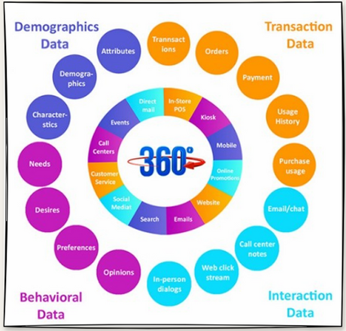
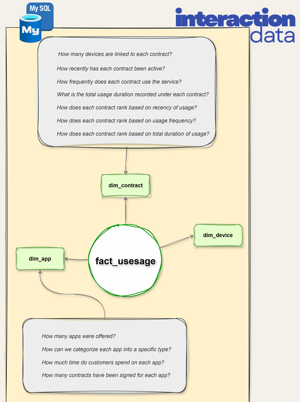
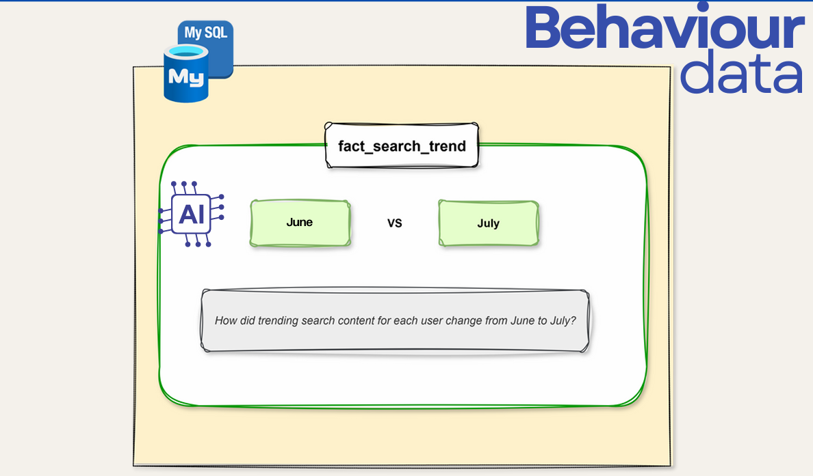
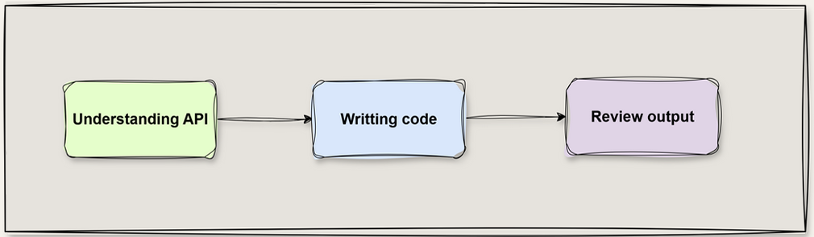
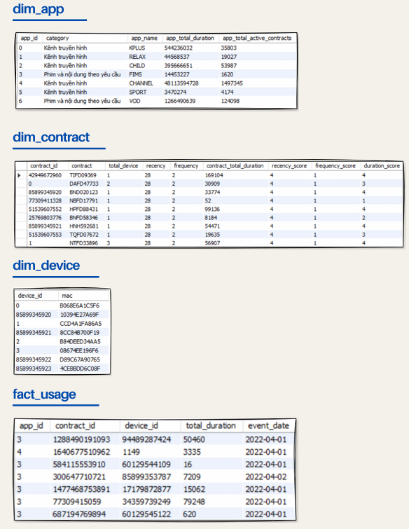
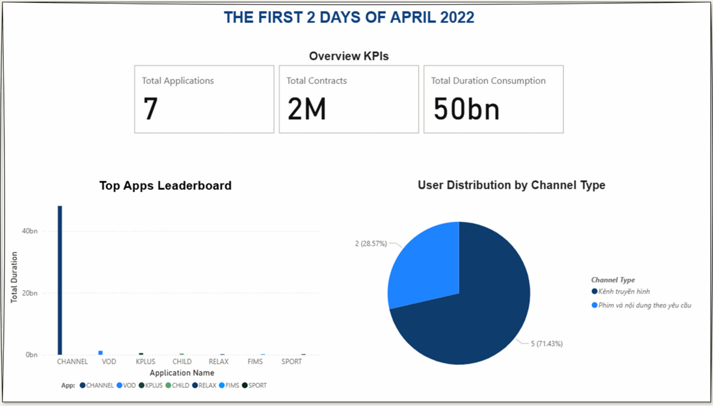
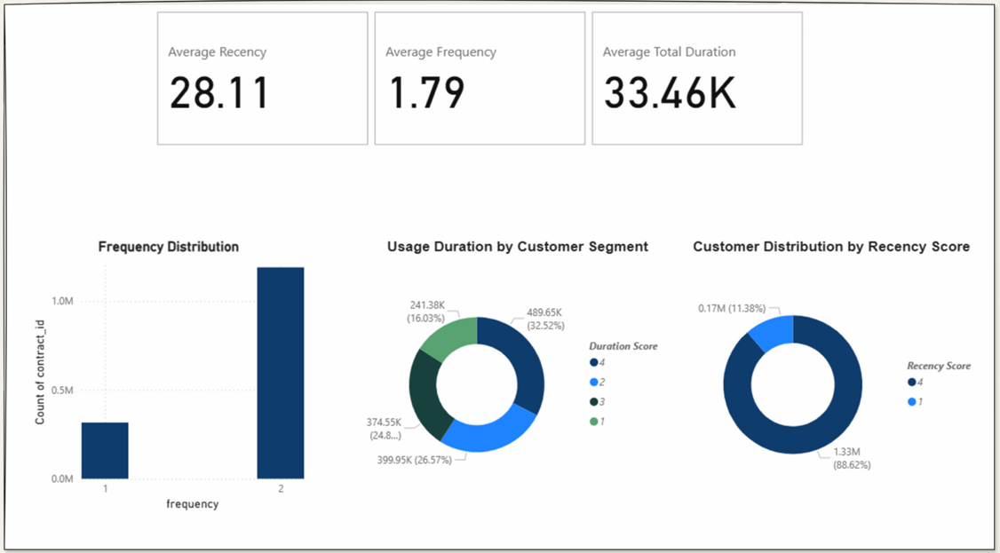
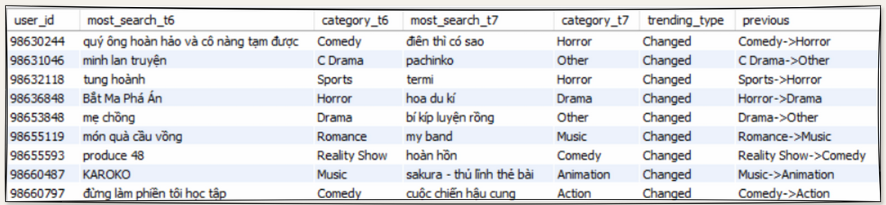
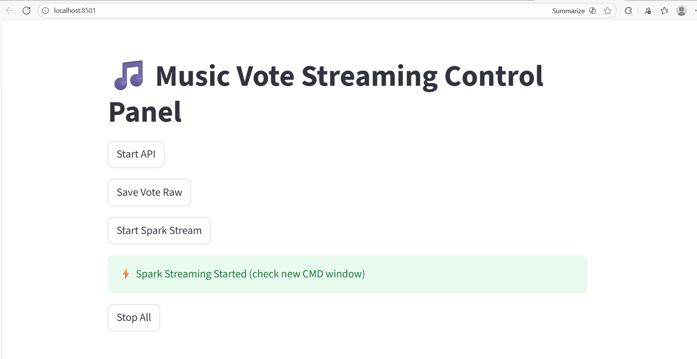
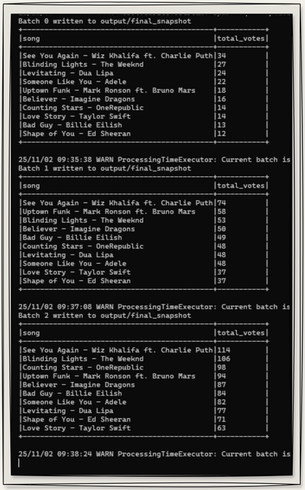

# Big Data Project: Raw Data → OLAP

 
 
 
 
 

---

## 📖 Table of Contents
1. [Introduction](#introduction)  
2. [High-Level Architecture](#high-level-architecture)  
3. [ETL Batch](#etl-batch)  
   - [log-content](#log-content)  
   - [log-search](#log-search)  
4. [ETL Streaming](#etl-streaming)  
5. [Tech Stack](#tech-stack)  
6. [Achievements](#results)  

---

## 🌟1. Introduction 
- **Goal**: Transform raw data into OLAP-ready datasets for Customer 360° analysis  
- **Scope**:  
  - **Batch ETL**: process static `log-content` (interaction data) and `log-search` (behaviour data)  
  - **Streaming ETL**: weekly top music video votes in real-time from simulator API  
- **Data Warehouse Design**: applied **RFM** analysis for customer insights  
- **Customer 360°**: provide an overview of customers across all touchpoints

> For full documentation, ETL steps, and in-depth analysis, see [big_data_report.pdf](big_data_report.pdf)

    

---

## 🏗 2. High-Level Architecture 
- Data flow overview: Raw data → ETL → OLAP / Data Mart → Dashboard  
 
    

---

## 💾 3. ETL Batch 
- **ETL process steps**:  
    

### 📌 Stage 1: log-content
- **Design concept**:  
   
- **Input**: raw interaction logs  
- **Output**: Star Schema Data Warehouse  

### 📌 Stage 2: log-search
- **Design concept**:  
   
- **Input**: customer search behaviour logs  
- **Output**: Flat Table showing customer search trends  

---

## ⚡ 4. ETL Streaming 
- **Story**: Each week is a “race” for the most-voted music videos. Spark Streaming continuously ingests votes, calculates real-time counts, and updates the leaderboard on console. Users see which videos are leading and which are gaining votes fast.  
- **Design concept**:  
    

- **Input**: JSON votes from Simulator API  
- **Output**: Streamlit leaderboard application

---

## 🛠 Tech Stack 

| Component         | Technology / Version       | Purpose                         |
|------------------|----------------------------|---------------------------------|
| Programming       | Python 3.10               | Core scripting                 |
| Batch / Streaming | Spark 3.5.6               | ETL & real-time processing     |
| Dashboard         | Streamlit latest          | Create interactive application |
| BI / Visualization| PowerBI                   | OLAP report dashboards         |
| Database          | MySQL                     | Data Warehouse / Data Mart     |
| ML / Classification| LM Studio                | Log-content classification     |

---

## 🏆 Achievements 
- **Batch ETL - log-content**: actual Star Schema output & dashboard  
    
    
    
- **Batch ETL - log-search**: actual Flat Table output, showing user search trends across different time periods.
  
    
- **Streaming ETL**: real-time leaderboard on console, simulating weekly “music video race”.  
    
    

---

**Author:** Sơn Vũ  
**Date:** 2025